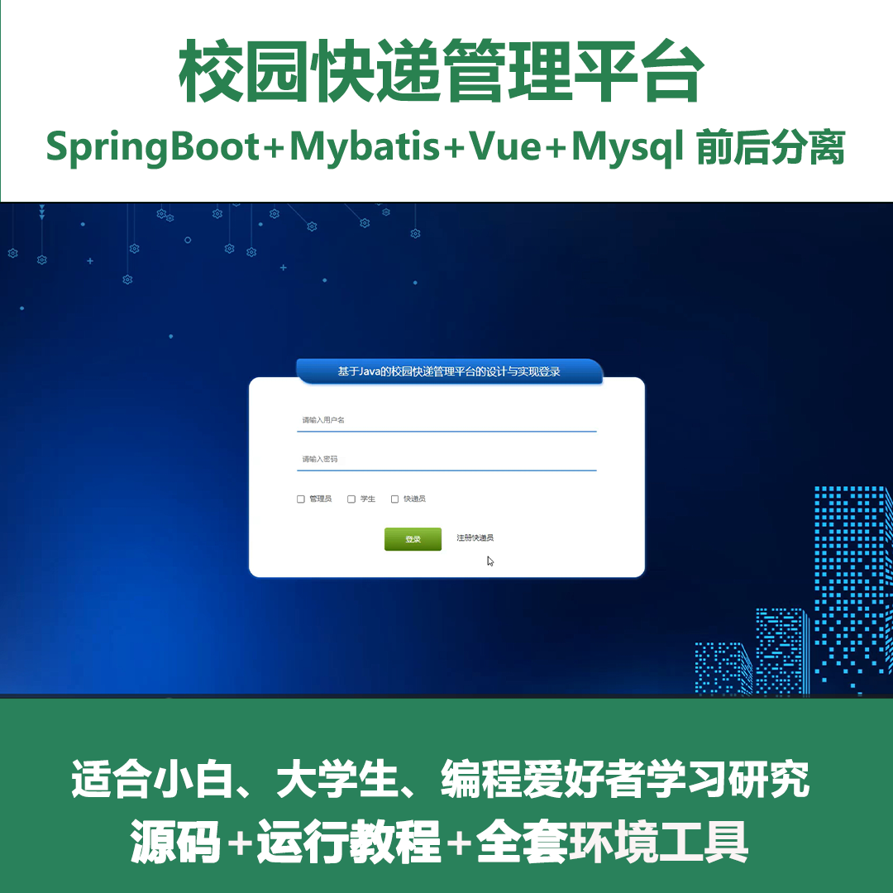
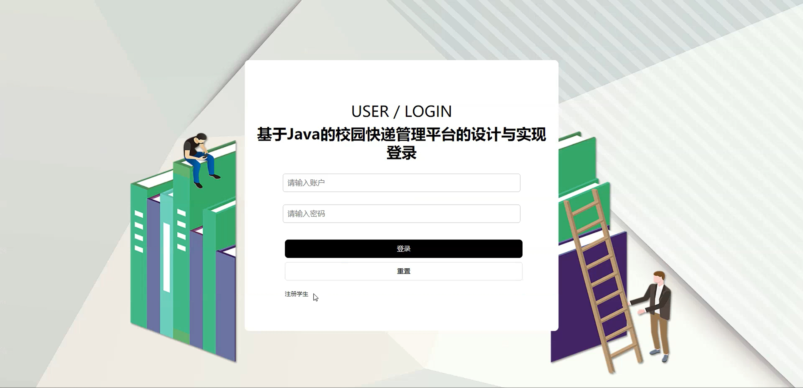
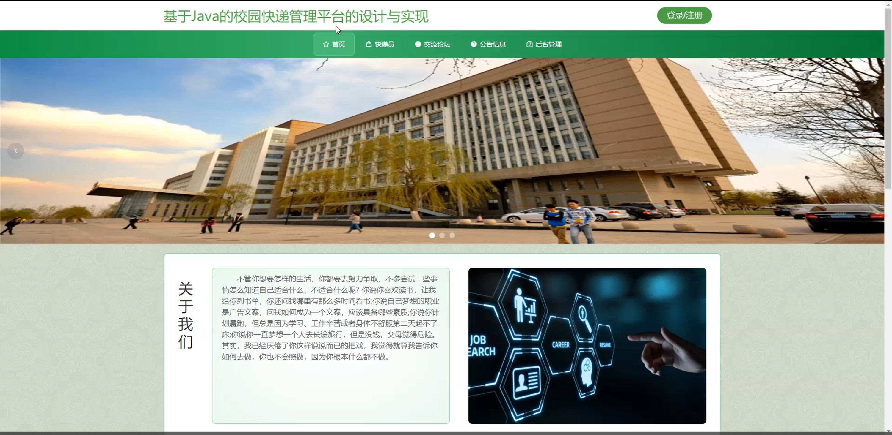
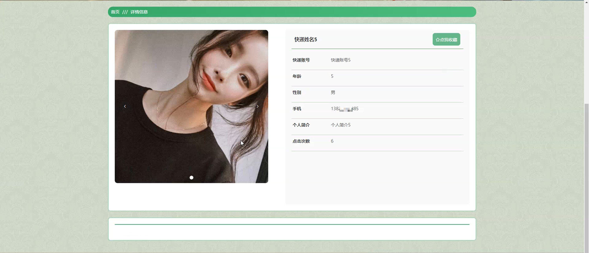
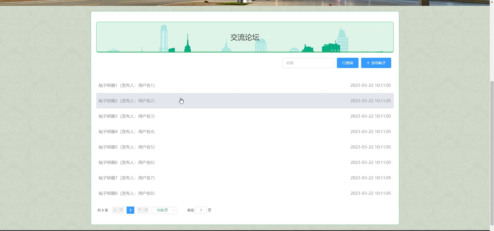
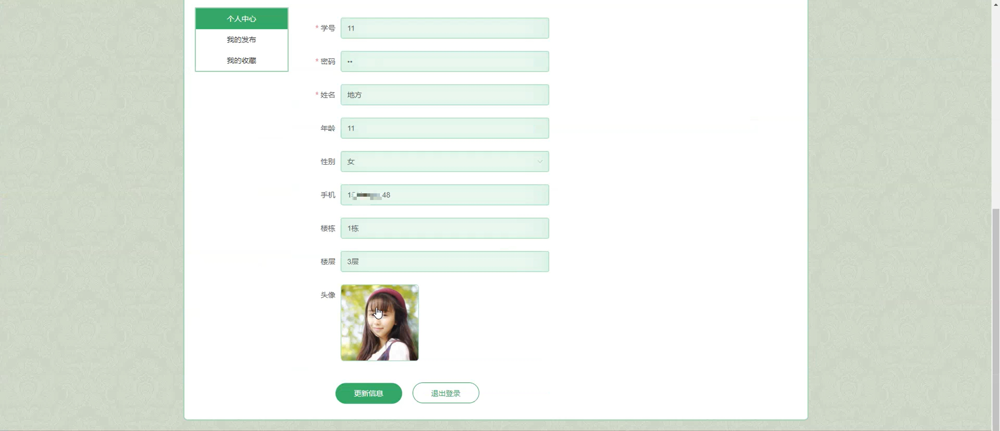
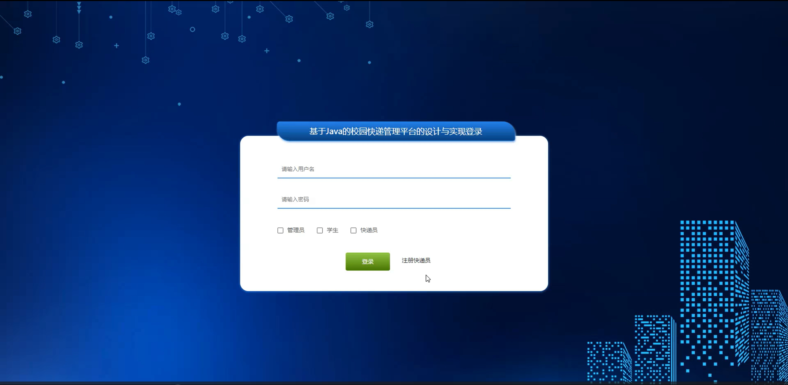
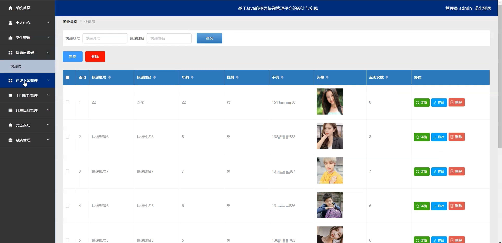
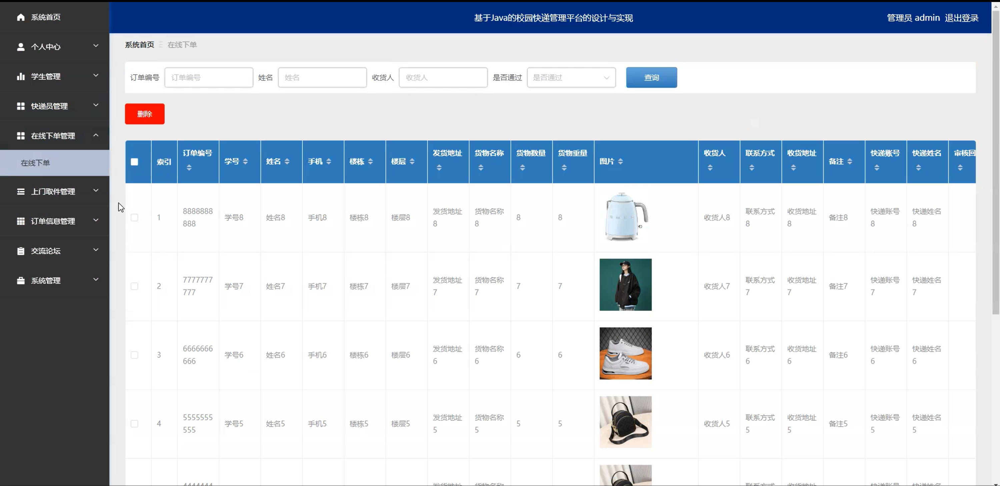
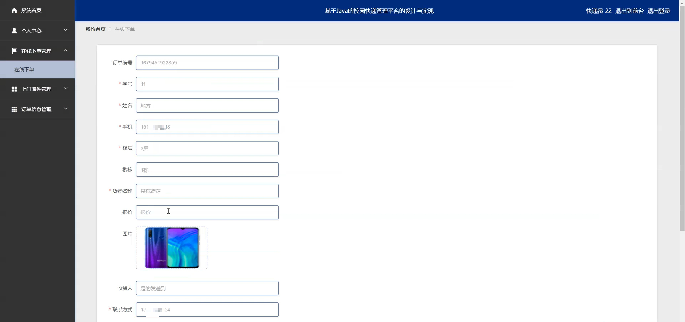

# springbootA282
springbootA282基于Java Springboot校园快递管理平台
 
## 查看主页获取源码

### 一、作品包含

源码+数据库+全套环境和工具资源+部署教程

### 二、项目技术

前端技术：Html、Css、Js、Vue、Element-ui

数据库：MySQL

后端技术：Java、Spring Boot、MyBatis

  

### 三、运行环境

开发工具：IDEA/eclipse

数据库：MySQL5.7

数据库管理工具：Navicat10以上版本

环境配置软件： JDK1.8+Maven3.6.3

前端Nodejs：14

### 四、项目介绍
项目编号：springbootA282

随着电子商务的迅猛发展和在线购物的普及，校园内的快递业务量急剧增加，给学生生活带来便利的同时，也带来了包裹分发效率低下、管理混乱等问题。为此，校园快递管理平台的建立显得尤为重要，它旨在优化校园快递服务流程，提高包裹处理速度，确保学生能够更加便捷、高效地收取快递。

前台学生功能：首页、快递员、交流论坛、公告信息、后台管理、个人中心、我的收藏、我的发布。

后台分为管理员、学生、快递员
管理员的功能：系统首页、个人中心、学生管理、快递员管理、在线下单管理、上门取件管理、订单信息管理、交流论坛、系统管理。
学生的功能：系统首页、个人中心、在线下单管理、上门取件管理、订单信息管理。
快递员的功能：系统首页、个人中心、在线下单管理、上门取件管理、订单信息管理。

### 五、运行截图

  
